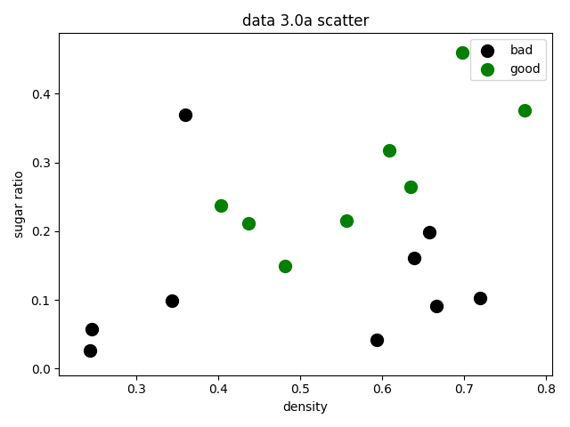
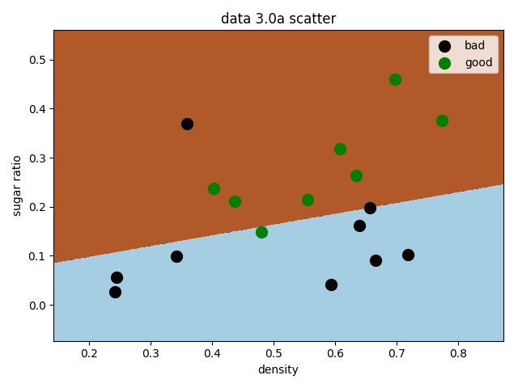
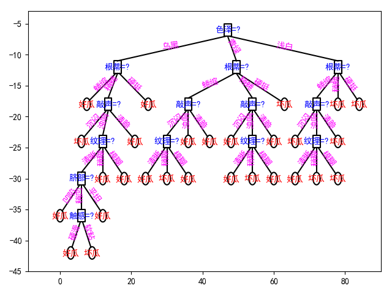
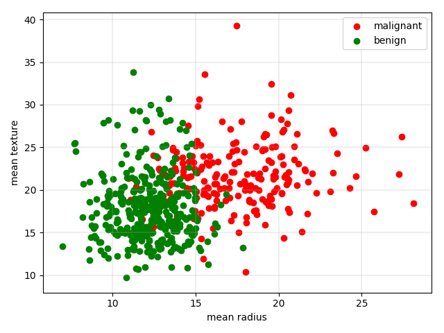
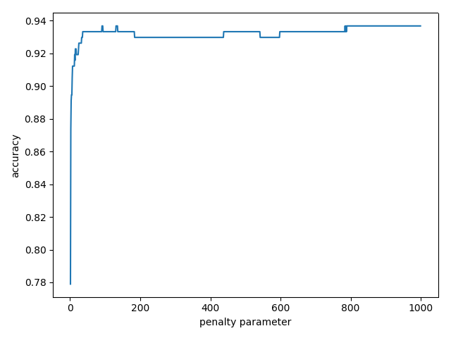
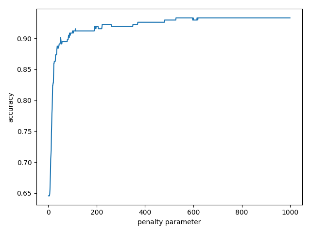
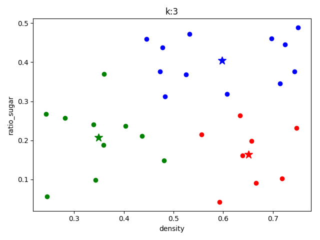
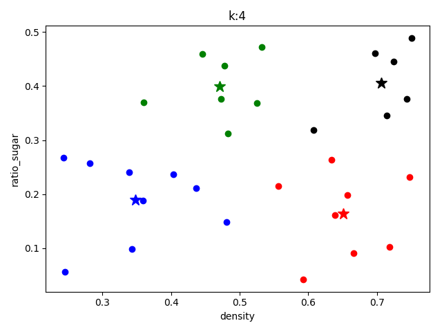
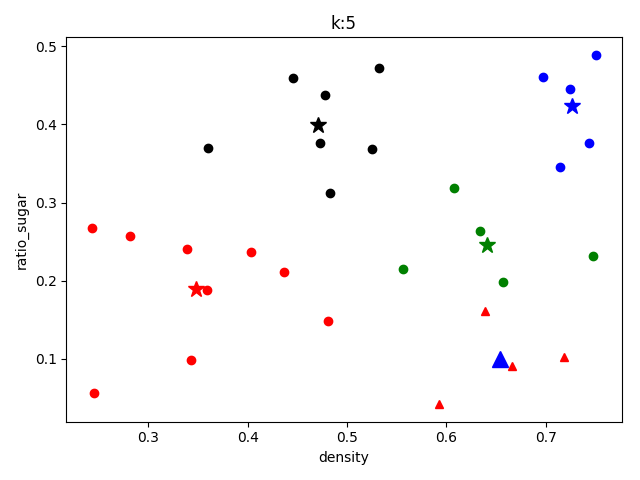

# 机器学习实验作业

## 3.3 编程实现对率回归，并给出西瓜数据集3.0α上的结果

### 数据准备

本题用到的西瓜数据集3.0α如下表：

| 编号 | 密度  | 含糖率 | 好瓜 |
| ---- | ----- | ------ | ---- |
| 1    | 0.697 | 0.46   | 1    |
| 2    | 0.774 | 0.376  | 1    |
| 3    | 0.634 | 0.264  | 1    |
| 4    | 0.608 | 0.318  | 1    |
| 5    | 0.556 | 0.215  | 1    |
| 6    | 0.403 | 0.237  | 1    |
| 7    | 0.481 | 0.149  | 1    |
| 8    | 0.437 | 0.211  | 1    |
| 9    | 0.666 | 0.091  | 0    |
| 10   | 0.243 | 0.0267 | 0    |
| 11   | 0.245 | 0.057  | 0    |
| 12   | 0.343 | 0.099  | 0    |
| 13   | 0.639 | 0.161  | 0    |
| 14   | 0.657 | 0.198  | 0    |
| 15   | 0.36  | 0.37   | 0    |
| 16   | 0.593 | 0.042  | 0    |
| 17   | 0.719 | 0.103  | 0    |

### 对数几率回归—分类学习算法

#### 编程环境

- 系统开发平台： Manjaro Linux
- 开发工具：PyCharm
- 开发语言：Python 3.7.1

#### Python代码

```python
#!/usr/bin/env python
# -*- coding: utf-8 -*-
'''
@LICENSE: Copyright(C) 2019, xiyusullos
@AUTHOR: xiyusullos
@BLOG: https://blog.xy-jit.cc
@FILE: 3.3.py
'''

import matplotlib.pylab as pl
import matplotlib.pyplot as plt
import numpy as np  # for matrix calculation
from sklearn import metrics
from sklearn import model_selection
from sklearn.linear_model import LogisticRegression

SCATTER_TITLE = 'data 3.0a scatter'
SCATTER_XLABEL = 'density'
SCATTER_YLABEL = 'sugar ratio'

# 加载对应数据
dataset = np.genfromtxt('data/3.3.csv', delimiter=',')
# 将数据按照属性分离开
X = dataset[:, 1:3]
y = dataset[:, 3]
m, n = np.shape(X)
# 绘制原始数据散点图
f1 = plt.figure(1)
plt.title(SCATTER_TITLE)
plt.xlabel(SCATTER_XLABEL)
plt.ylabel(SCATTER_YLABEL)

plt.scatter(X[y == 0, 0], X[y == 0, 1], marker='o', color='k', s=100, label='bad')
plt.scatter(X[y == 1, 0], X[y == 1, 1], marker='o', color='g', s=100, label='good')
plt.legend(loc='upper right')
plt.show()

# 生成测试和训练数据集
X_train, X_test, y_train, y_test = model_selection.train_test_split(X, y, test_size=0.5, random_state=0)
# 模型训练
log_model = LogisticRegression()  # using log-regression lib model
log_model.fit(X_train, y_train)  # fitting
# 模型验证
y_pred = log_model.predict(X_test)
# 总结模型的适用性
print(metrics.confusion_matrix(y_test, y_pred))
print(metrics.classification_report(y_test, y_pred))
precision, recall, thresholds = metrics.precision_recall_curve(y_test, y_pred)
# 显示决策边界
f2 = plt.figure(2)
h = 0.001
x0_min, x0_max = X[:, 0].min() - 0.1, X[:, 0].max() + 0.1
x1_min, x1_max = X[:, 1].min() - 0.1, X[:, 1].max() + 0.1
x0, x1 = np.meshgrid(np.arange(x0_min, x0_max, h), np.arange(x1_min, x1_max, h))
# 这里“模型”是你模型的预测（分类）功能
z = log_model.predict(np.c_[x0.ravel(), x1.ravel()])
# 将结果标记出来
z = z.reshape(x0.shape)
plt.contourf(x0, x1, z, cmap=pl.cm.Paired)
plt.title(SCATTER_TITLE)
plt.xlabel(SCATTER_XLABEL)
plt.ylabel(SCATTER_YLABEL)
plt.scatter(X[y == 0, 0], X[y == 0, 1], marker='o', color='k', s=100, label='bad')
plt.scatter(X[y == 1, 0], X[y == 1, 1], marker='o', color='g', s=100, label='good')
plt.legend(loc='upper right')
plt.show()

```

#### 代码结果





#### 结果分析

由于原数据表数据较少，但这里还是先划分训练集和测试集，基于训练集直接拟合出逻辑回归模型，然后在测试集上评估模型。得出混淆矩阵
$$
\begin{bmatrix}
4 & 1 \\
1 & 3 \\
\end{bmatrix}
$$
和相关度量（查准率（准确率）、查全率（召回率），F1值）结果如下：

|              | precision | recall | f1-score | support |
| ------------ | --------- | ------ | -------- | ------- |
| 0.0          | 0.80      | 0.80   | 0.80     | 5       |
| 1.0          | 0.75      | 0.75   | 0.75     | 4       |
| micro avg    | 0.78      | 0.78   | 0.78     | 9       |
| macro avg    | 0.78      | 0.78   | 0.78     | 9       |
| weighted avg | 0.78      | 0.78   | 0.78     | 9       |

由混淆矩阵可以看到，由于样本本身数量较少，模型拟合效果一般，总体预测精度约为0.78。可以通过扩充数据，进一步的提高精度。

## 4.3 试编程实现基于信息熵进行划分选择的决策树算法，并为表4.2中数据生成一棵决策树。

### 数据准备

- 分析数据：变量包含“色泽”等8个属性，其中6个标称属性，2个连续属性。类标签为好或者坏瓜（二分类）。具体情况如表1。
- 处理数据：由数据表生成.csv文件。采用pandas.read_csv()读取数据（在这里用到pandas库），
- 数据可视化：采用seaborn可视化部分数据来进行初步判断。

| 编号 | 色泽 | 根蒂 | 敲声 | 纹理 | 脐部 | 触感 | 密度  | 含糖率 | 好坏 |
| ---- | ---- | ---- | ---- | ---- | ---- | ---- | ----- | ------ | ---- |
| 1    | 青绿 | 蜷缩 | 浊响 | 清晰 | 凹陷 | 硬滑 | 0.697 | 0.46   | 好瓜 |
| 2    | 乌黑 | 蜷缩 | 沉闷 | 清晰 | 凹陷 | 硬滑 | 0.744 | 0.376  | 好瓜 |
| 3    | 乌黑 | 蜷缩 | 浊响 | 清晰 | 凹陷 | 硬滑 | 0.634 | 0.264  | 好瓜 |
| 4    | 青绿 | 蜷缩 | 沉闷 | 清晰 | 凹陷 | 硬滑 | 0.608 | 0.318  | 好瓜 |
| 5    | 浅白 | 蜷缩 | 浊响 | 清晰 | 凹陷 | 硬滑 | 0.556 | 0.215  | 好瓜 |
| 6    | 青绿 | 稍蜷 | 浊响 | 清晰 | 稍凹 | 软粘 | 0.403 | 0.237  | 好瓜 |
| 7    | 乌黑 | 稍蜷 | 浊响 | 稍糊 | 稍凹 | 软粘 | 0.481 | 0.149  | 好瓜 |
| 8    | 乌黑 | 稍蜷 | 浊响 | 清晰 | 稍凹 | 硬滑 | 0.437 | 0.211  | 好瓜 |
| 9    | 乌黑 | 稍蜷 | 沉闷 | 稍糊 | 稍凹 | 硬滑 | 0.666 | 0.091  | 坏瓜 |
| 10   | 青绿 | 硬挺 | 清脆 | 清晰 | 平坦 | 软粘 | 0.243 | 0.267  | 坏瓜 |
| 11   | 浅白 | 硬挺 | 清脆 | 模糊 | 平坦 | 硬滑 | 0.245 | 0.057  | 坏瓜 |
| 12   | 浅白 | 蜷缩 | 浊响 | 模糊 | 平坦 | 软粘 | 0.343 | 0.099  | 坏瓜 |
| 13   | 青绿 | 稍蜷 | 浊响 | 稍糊 | 凹陷 | 硬滑 | 0.639 | 0.161  | 坏瓜 |
| 14   | 浅白 | 稍蜷 | 沉闷 | 稍糊 | 凹陷 | 硬滑 | 0.657 | 0.198  | 坏瓜 |
| 15   | 乌黑 | 稍蜷 | 浊响 | 清晰 | 稍凹 | 软粘 | 0.36  | 0.37   | 坏瓜 |
| 16   | 浅白 | 蜷缩 | 浊响 | 模糊 | 平坦 | 硬滑 | 0.593 | 0.042  | 坏瓜 |
| 17   | 青绿 | 蜷缩 | 沉闷 | 稍糊 | 稍凹 | 硬滑 | 0.719 | 0.103  | 坏瓜 |

### 决策树算法实现

#### 算法思想

基于树结构进行决策：

- 每个“内部结点”对应于某个属性上的“测试”(test)
- 每个分支对应于该测试的一种可能结果（即该属性的某个取值）
- 每个“叶结点”对应于一个“预测结果”

主要包含两个过程：

1. 学习过程：通过对训练样本的分析来确定“划分属性”；
2. 预测过程：将测试示例从根结点开始，沿着划分属性所构成的“判定测试序列”下行，直到叶结点

#### 编程环境

- 系统开发平台： Manjaro Linux
- 开发工具：PyCharm
- 开发语言：Python 3.7.1

#### Python代码

实现思路

- 基本流程：自根至叶的递归过程，在每个中间结点寻找一个“划分”属性。
- 处理策略：
  1. 对于树形结构，可以创建节点类来进行操作，根据书p74决策树基本算法，广泛采用递归操作；
  2. 对于连续属性（密度、含糖率），对其进行离散化（可采用二分法）；
  3. 对于标称属性（色泽、纹理等），考虑Python字典，方便操作其特征类别（如：‘色泽’：‘青绿’，‘乌黑’，‘浅白’）；
- 停止条件：
  1. 当前结点包含的样本全属于同一类别，无需划分;
  2. 当前属性集为空, 或是所有样本在所有属性上取值相同，无法划分;
  3. 当前结点包含的样本集合为空，不能划分.

```python
#!/usr/bin/env python
# -*- coding: utf-8 -*-
'''
@LICENSE: Copyright(C) 2019, xiyusullos
@AUTHOR: xiyusullos
@BLOG: https://blog.xy-jit.cc
@FILE: 4.3.py
'''

import math

import matplotlib as mpl
import numpy as np
from matplotlib import pyplot as plt

mpl.rcParams['font.sans-serif'] = ['SimHei']  # 用来正常显示中文标签
mpl.rcParams['axes.unicode_minus'] = False  # 用来正常显示负号


print(mpl.matplotlib_fname())

class TreeNode:
    '''
    树的节点类
    data:树的数组结构的一项，4值
    height:节点的高
    '''

    def __init__(self, data, height):
        self.father = data[0]  # 父节点
        self.children = []  # 子节点列表
        self.data = data[1]  # 节点标签
        self.height = height
        self.pos = 0  # 节点计算时最终位置，计算时只保存相对位置
        self.offset = 0  # 节点最终位置与初始位置的相对值
        self.data_to_father = data[2]  # 链接父节点的属性值
        # 如果有阈值，则加入阈值
        if type(data[3]) != list:
            self.data_to_father = self.data_to_father + str(data[3]);


class DtreePlot:
    def __init__(self, link, minspace, r, lh):
        '''
        树的绘制类
        link:树的数组结构
        minspace:节点间的距离
        r:节点的绘制半径
        lh:层高
        '''

        s = len(link)
        # 所有节点的列表，第一项为根节点
        treenodelist = []
        # 节点的层次结构
        treelevel = []

        # 处理树的数组结构
        for i in range(0, s):
            # 根节点的index与其父节点的index相同
            if link[i][0] == i:
                treenodelist.append(TreeNode(link[i], 0))
            else:
                treenodelist.append(TreeNode(link[i], treenodelist[link[i][0]].height + 1))
                treenodelist[link[i][0]].children.append(treenodelist[i]);
                treenodelist[i].father = treenodelist[link[i][0]];
            # 如果有新一层的节点则新建一层
            if len(treelevel) == treenodelist[i].height:
                treelevel.append([])
            treelevel[treenodelist[i].height].append(treenodelist[i])

        # 控制绘制图像的坐标轴
        self.right = 0
        self.left = 0
        # 反转层次，从底往上画
        treelevel.reverse()
        # 计算每个节点的位置
        self.__calpos(treelevel, minspace)
        # 绘制树形
        self.__drawtree(treenodelist[0], r, lh, 0)
        plt.xlim(xmin=self.left, xmax=self.right + minspace)
        plt.ylim(ymin=len(treelevel) * lh + lh / 2, ymax=lh / 2)
        plt.show()

    def __calonebyone(self, nodes, l, r, start, minspace):

        '''
        逐一绘制计算每个节点的位置
        nodes:节点集合
        l,r:左右区间
        start:当前层的初始绘制位置
        minspace:使用的最小间距
        '''

        for i in range(l, r):
            nodes[i].pos = max(nodes[i].pos, start)
            start = nodes[i].pos + minspace;
        return start;

    def __calpos(self, treelevel, minspace):
        '''
        计算每个节点的位置与相对偏移
        treelevel：树的层次结构
        minspace:使用的最小间距
        '''

        # 按层次画
        for nodes in treelevel:
            # 记录非叶节点
            noleaf = []
            num = 0;
            for node in nodes:
                if len(node.children) > 0:
                    noleaf.append(num)
                    node.pos = (node.children[0].pos + node.children[-1].pos) / 2
                num = num + 1

            start = minspace

            # 如果全是非叶节点，直接绘制
            if (len(noleaf)) == 0:
                self.__calonebyone(nodes, 0, len(nodes), 0, minspace)
            else:
                start = nodes[noleaf[0]].pos - noleaf[0] * minspace
                self.left = min(self.left, start - minspace)
                start = self.__calonebyone(nodes, 0, noleaf[0], start, minspace)
                for i in range(0, len(noleaf)):
                    nodes[noleaf[i]].offset = max(nodes[noleaf[i]].pos, start) - nodes[noleaf[i]].pos
                    nodes[noleaf[i]].pos = max(nodes[noleaf[i]].pos, start)

                    if (i < len(noleaf) - 1):
                        # 计算两个非叶节点中间的间隔，如果足够大就均匀绘制
                        dis = (nodes[noleaf[i + 1]].pos - nodes[noleaf[i]].pos) / (noleaf[i + 1] - noleaf[i])
                        start = nodes[noleaf[i]].pos + max(minspace, dis)
                        start = self.__calonebyone(nodes, noleaf[i] + 1, noleaf[i + 1], start, max(minspace, dis))
                    else:
                        start = nodes[noleaf[i]].pos + minspace
                        start = self.__calonebyone(nodes, noleaf[i] + 1, len(nodes), start, minspace)

    def __drawtree(self, treenode, r, lh, curoffset):
        '''
        采用先根遍历绘制树
        treenode:当前遍历的节点
        r:半径
        lh:层高
        curoffset:每层节点的累计偏移
        '''
        # 加上当前的累计偏差得到最终位置
        treenode.pos = treenode.pos + curoffset

        if (treenode.pos > self.right):
            self.right = treenode.pos

        # 如果是叶节点则画圈，非叶节点画方框
        if (len(treenode.children) > 0):
            drawrect(treenode.pos, (treenode.height + 1) * lh, r)
            plt.text(treenode.pos, (treenode.height + 1) * lh, treenode.data + '=?', color=(0, 0, 1), ha='center',
                     va='center')
        else:
            drawcircle(treenode.pos, (treenode.height + 1) * lh, r)
            plt.text(treenode.pos, (treenode.height + 1) * lh, treenode.data, color=(1, 0, 0), ha='center', va='center')

        num = 0;
        # 先根遍历
        for node in treenode.children:
            self.__drawtree(node, r, lh, curoffset + treenode.offset)

            # 绘制父节点到子节点的连线
            num = num + 1

            px = (treenode.pos - r) + 2 * r * num / (len(treenode.children) + 1)
            py = (treenode.height + 1) * lh - r - 0.02

            # 按到圆到方框分开画
            if (len(node.children) > 0):
                px1 = node.pos
                py1 = (node.height + 1) * lh + r
                off = np.array([px - px1, py - py1])
                off = off * r / np.linalg.norm(off)

            else:
                off = np.array([px - node.pos, -lh + 1])
                off = off * r / np.linalg.norm(off)
                px1 = node.pos + off[0]
                py1 = (node.height + 1) * lh + off[1]

            # 计算父节点与子节点连线的方向与角度
            plt.plot([px, px1], [py, py1], color=(0, 0, 0))
            pmx = (px1 + px) / 2 - (1 - 2 * (px < px1)) * 0.4
            pmy = (py1 + py) / 2 + 0.4
            arc = np.arctan(off[1] / (off[0] + 0.0000001))
            # 绘制文本以及旋转
            plt.text(pmx, pmy, node.data_to_father, color=(1, 0, 1), ha='center', va='center',
                     rotation=arc / np.pi * 180)


def drawcircle(x, y, r):
    '''
    画圆
    '''

    theta = np.arange(0, 2 * np.pi, 2 * np.pi / 1000)
    theta = np.append(theta, [2 * np.pi])
    x1 = []
    y1 = []
    for tha in theta:
        x1.append(x + r * np.cos(tha))
        y1.append(y + r * np.sin(tha))
    plt.plot(x1, y1, color=(0, 0, 0))


def drawrect(x, y, r):
    '''
    画矩形
    '''

    x1 = [x - r, x + r, x + r, x - r, x - r]
    y1 = [y - r, y - r, y + r, y + r, y - r]
    plt.plot(x1, y1, color=(0, 0, 0))


class Property:
    '''
    属性类
    '''

    def __init__(self, idnum, attribute):
        self.is_continuity = False  # 连续型属性标记
        self.attribute = attribute  # 属性标签
        self.subattributes = []  # 属性子标签
        self.id = idnum  # 属性排在输入文本的第几位
        self.index = {}  # 属性子标签的索引值


class Dtree():
    '''
    决策树生成类
    '''

    def __init__(self, filename, haveID, property_set):
        '''
        构造函数
        filename:输入文件名
        haveID:输入是否带序号
        property_set：为空则计算全部属性，否则记录set中的属性
        '''

        self.data = []
        self.data_property = []
        # 读入数据
        self.__dataread(filename, haveID)
        # 判断选择的属性集合
        if len(property_set) > 0:
            tmp_data_property = []
            for i in property_set:
                tmp_data_property.append(self.data_property[i])
            tmp_data_property.append(self.data_property[-1])
        else:
            tmp_data_property = self.data_property

        # 决策树树形数组结构
        self.treelink = []

        # 决策树主递归
        self.__TreeGenerate(range(0, len(self.data[-1])), tmp_data_property, 0, [], [])

        # 决策树绘制
        DtreePlot(self.treelink, 6, 1, -6)

    def __TreeGenerate(self, data_set, property_set, father, attribute, threshold):
        '''
        决策树主递归
        data_set:当前样本集合
        property_set：当前熟悉集合
        father:父节点索引值
        attribute:父节点连接当前节点的子属性值
        threshold:如果是连续参数就是阈值，否则为空
        '''
        # 新增一个节点
        self.treelink.append([])
        # 新节点的位置
        curnode = len(self.treelink) - 1
        # 记录新节点的父亲节点
        self.treelink[curnode].append(father)

        # 结束条件1：所有样本同一分类
        current_data_class = self.__count(data_set, property_set[-1])
        if (len(current_data_class) == 1):
            self.treelink[curnode].append(self.data[-1][data_set[0]])
            self.treelink[curnode].append(attribute)
            self.treelink[curnode].append(threshold)
            return

        # 结束条件2：所有样本相同属性，选择分类数多的一类作为分类
        if all(len(self.__count(data_set, property_set[i])) == 1 for i in range(0, len(property_set) - 1)):
            max_count = -1;
            for dataclass in property_set[-1].subattributes:
                if current_data_class[dataclass] > max_count:
                    max_attribute = dataclass
                    max_count = current_data_class[dataclass]
            self.treelink[curnode].append(max_attribute)
            self.treelink[curnode].append(attribute)
            self.treelink[curnode].append(threshold)
            return

        # 信息增益选择最优属性与阈值
        prop, threshold = self.__entropy_paraselect(data_set, property_set)

        # 记录当前节点的最优属性标签与父节点连接当前节点的子属性值
        self.treelink[curnode].append(prop.attribute)
        self.treelink[curnode].append(attribute)

        # 从属性集合中移除当前属性
        property_set.remove(prop)

        # 判断是否是连续属性
        if (prop.is_continuity):
            # 连续属性分为2子属性，大于和小于
            tmp_data_set = [[], []]
            for i in data_set:
                tmp_data_set[self.data[prop.id][i] > threshold].append(i)
            for i in [0, 1]:
                self.__TreeGenerate(tmp_data_set[i], property_set[:], curnode, prop.subattributes[i], threshold)
        else:
            # 离散属性有多子属性
            tmp_data_set = [[] for i in range(0, len(prop.subattributes))]
            for i in data_set:
                tmp_data_set[prop.index[self.data[prop.id][i]]].append(i)

            for i in range(0, len(prop.subattributes)):
                if len(tmp_data_set[i]) > 0:
                    self.__TreeGenerate(tmp_data_set[i], property_set[:], curnode, prop.subattributes[i], [])
                else:
                    # 如果某一个子属性不存没有对应的样本，则选择父节点分类更多的一项作为分类
                    self.treelink.append([])
                    max_count = -1;
                    tnode = len(self.treelink) - 1
                    for dataclass in property_set[-1].subattributes:
                        if current_data_class[dataclass] > max_count:
                            max_attribute = dataclass
                            max_count = current_data_class[dataclass]
                    self.treelink[tnode].append(curnode)
                    self.treelink[tnode].append(max_attribute)
                    self.treelink[tnode].append(prop.subattributes[i])
                    self.treelink[tnode].append(threshold)

                    # 为没有4个值得节点用空列表补齐4个值
        for i in range(len(self.treelink[curnode]), 4):
            self.treelink[curnode].append([])

    def __entropy_paraselect(self, data_set, property_set):
        '''
        信息增益算则最佳属性
        data_set:当前样本集合
        property_set:当前属性集合
        '''

        # 分离散和连续型分别计算信息增益，选择最大的一个
        max_ent = -10000
        for i in range(0, len(property_set) - 1):
            prop_id = property_set[i].id
            if (property_set[i].is_continuity):
                tmax_ent = -10000
                xlist = self.data[prop_id][:]
                xlist.sort()
                # 连续型求出相邻大小值的平局值作为待选的最佳阈值
                for j in range(0, len(xlist) - 1):
                    xlist[j] = (xlist[j + 1] + xlist[j]) / 2
                for j in range(0, len(xlist) - 1):
                    if (i > 0 and xlist[j] == xlist[j - 1]):
                        continue
                    cur_ent = 0
                    nums = [[0, 0], [0, 0]]
                    for k in data_set:
                        nums[self.data[prop_id][k] > xlist[j]][property_set[-1].index[self.data[-1][k]]] += 1
                    for k in [0, 1]:
                        subattribute_sum = nums[k][0] + nums[k][1]
                        if (subattribute_sum > 0):
                            p = nums[k][0] / subattribute_sum
                            cur_ent += (p * math.log(p + 0.00001, 2) + (1 - p) * math.log(1 - p + 0.00001,
                                                                                          2)) * subattribute_sum / len(
                                data_set)
                    if (cur_ent > tmax_ent):
                        tmax_ent = cur_ent
                        tmp_threshold = xlist[j]
                if (tmax_ent > max_ent):
                    max_ent = tmax_ent;
                    bestprop = property_set[i];
                    best_threshold = tmp_threshold;
            else:
                # 直接统计并计算
                cur_ent = 0
                nums = [[0, 0] for i in range(0, len(property_set[i].subattributes))]
                for j in data_set:
                    nums[property_set[i].index[self.data[prop_id][j]]][property_set[-1].index[self.data[-1][j]]] += 1
                for j in range(0, len(property_set[i].subattributes)):
                    subattribute_sum = nums[j][0] + nums[j][1]
                    if (subattribute_sum > 0):
                        p = nums[j][0] / subattribute_sum
                        cur_ent += (p * math.log(p + 0.00001, 2) + (1 - p) * math.log(1 - p + 0.00001,
                                                                                      2)) * subattribute_sum / len(
                            data_set)
                if (cur_ent > max_ent):
                    max_ent = cur_ent;
                    bestprop = property_set[i];
                    best_threshold = [];
                return bestprop, best_threshold

    def __count(self, data_set, prop):

        '''
        计算当前样本在某个属性下的分类情况
        '''
        out = {}

        rowdata = self.data[prop.id]
        for i in data_set:
            if rowdata[i] in out:
                out[rowdata[i]] += 1
            else:
                out[rowdata[i]] = 1;
        return out

    def __dataread(self, filename, haveID):
        '''
        输入数据处理
        '''
        file = open(filename, 'r')
        linelen = 0
        first = 1
        while 1:
            # 按行读
            line = file.readline()

            if not line:
                break

            line = line.strip('\n')
            rowdata = line.split(',')
            # 如果有编号就去掉第一列
            if haveID:
                del rowdata[0]

            if (linelen == 0):
                # 处理第一行，初始化属性类对象，记录属性的标签
                for i in range(0, len(rowdata)):
                    self.data.append([])
                    self.data_property.append(Property(i, rowdata[i]))
                    self.data_property[i].attribute = rowdata[i]
                linelen = len(rowdata)
            elif (linelen == len(rowdata)):
                if (first == 1):
                    # 处理第二行，记录属性是否是连续型和子属性
                    for i in range(0, len(rowdata)):
                        if (isnumeric(rowdata[i])):
                            self.data_property[i].is_continuity = True
                            self.data[i].append(float(rowdata[i]))
                            self.data_property[i].subattributes.append("小于")
                            self.data_property[i].index["小于"] = 0
                            self.data_property[i].subattributes.append("大于")
                            self.data_property[i].index["大于"] = 1
                        else:
                            self.data[i].append(rowdata[i])
                else:
                    # 处理后面行，记录子属性
                    for i in range(0, len(rowdata)):
                        if (self.data_property[i].is_continuity):
                            self.data[i].append(float(rowdata[i]))
                        else:
                            self.data[i].append(rowdata[i])
                            if rowdata[i] not in self.data_property[i].subattributes:
                                self.data_property[i].subattributes.append(rowdata[i])
                                self.data_property[i].index[rowdata[i]] = len(self.data_property[i].subattributes) - 1
                first = 0
            else:
                continue


def isnumeric(s):
    '''
    判断是否是数字
    '''
    return all(c in "0123456789.-" for c in s)


if __name__ == '__main__':
    link = Dtree('data/table_4.2.csv', True, range(6))

```


#### 代码结果



#### 结果分析

对与西瓜数据集3.0数据新型分析，通过信息熵进行决策，生成了上图的决策树。

## 5.5 试编程实现标准BP算法和累积BP算法，在西瓜数据集3.0上分别用这两个算法训练一个单隐层网络，并进行比较。

### 数据准备

| 编号 | 色泽 | 根蒂 | 敲声 | 纹理 | 脐部 | 触感 | 密度  | 含糖率 | 好坏 |
| ---- | ---- | ---- | ---- | ---- | ---- | ---- | ----- | ------ | ---- |
| 1    | 青绿 | 蜷缩 | 浊响 | 清晰 | 凹陷 | 硬滑 | 0.697 | 0.46   | 好瓜 |
| 2    | 乌黑 | 蜷缩 | 沉闷 | 清晰 | 凹陷 | 硬滑 | 0.744 | 0.376  | 好瓜 |
| 3    | 乌黑 | 蜷缩 | 浊响 | 清晰 | 凹陷 | 硬滑 | 0.634 | 0.264  | 好瓜 |
| 4    | 青绿 | 蜷缩 | 沉闷 | 清晰 | 凹陷 | 硬滑 | 0.608 | 0.318  | 好瓜 |
| 5    | 浅白 | 蜷缩 | 浊响 | 清晰 | 凹陷 | 硬滑 | 0.556 | 0.215  | 好瓜 |
| 6    | 青绿 | 稍蜷 | 浊响 | 清晰 | 稍凹 | 软粘 | 0.403 | 0.237  | 好瓜 |
| 7    | 乌黑 | 稍蜷 | 浊响 | 稍糊 | 稍凹 | 软粘 | 0.481 | 0.149  | 好瓜 |
| 8    | 乌黑 | 稍蜷 | 浊响 | 清晰 | 稍凹 | 硬滑 | 0.437 | 0.211  | 好瓜 |
| 9    | 乌黑 | 稍蜷 | 沉闷 | 稍糊 | 稍凹 | 硬滑 | 0.666 | 0.091  | 坏瓜 |
| 10   | 青绿 | 硬挺 | 清脆 | 清晰 | 平坦 | 软粘 | 0.243 | 0.267  | 坏瓜 |
| 11   | 浅白 | 硬挺 | 清脆 | 模糊 | 平坦 | 硬滑 | 0.245 | 0.057  | 坏瓜 |
| 12   | 浅白 | 蜷缩 | 浊响 | 模糊 | 平坦 | 软粘 | 0.343 | 0.099  | 坏瓜 |
| 13   | 青绿 | 稍蜷 | 浊响 | 稍糊 | 凹陷 | 硬滑 | 0.639 | 0.161  | 坏瓜 |
| 14   | 浅白 | 稍蜷 | 沉闷 | 稍糊 | 凹陷 | 硬滑 | 0.657 | 0.198  | 坏瓜 |
| 15   | 乌黑 | 稍蜷 | 浊响 | 清晰 | 稍凹 | 软粘 | 0.36  | 0.37   | 坏瓜 |
| 16   | 浅白 | 蜷缩 | 浊响 | 模糊 | 平坦 | 硬滑 | 0.593 | 0.042  | 坏瓜 |
| 17   | 青绿 | 蜷缩 | 沉闷 | 稍糊 | 稍凹 | 硬滑 | 0.719 | 0.103  | 坏瓜 |

### 算法思想

#### 标准BP算法

输入： 训练集 D，学习率 η.

过程：

1. 随即初始化连接权与阈值 (ω，θ). 
2. Repeat：
3. for x_k，y_k in D:
4. 根据当前参数计算出样本误差 E_k.
5. 根据公式计算出随机梯度项 g_k.
6. 根据公式更新 (ω，θ).
7. end for
8. until 达到停止条件

输出：(ω，θ) - 即相应的多层前馈神经网络.

#### 累积BP算法

输入： 训练集 D，学习率 η，迭代次数 n.

过程： 

1. 随即初始化连接权与阈值 (ω，θ).
2. Repeat：
3. 根据当前参数计算出累积误差 E.
4. 根据公式计算出标准梯度项 g.
5. 根据公式更新 (ω，θ).
6. n = n-1
7. until n=0 or 达到停止条件

输出：(ω，θ) - 即相应的多层前馈神经网络.

#### 两种算法的区别

标准BP算法每次针对单个训练样例更新权值与阈值，参数更新频繁, 不同样例可能抵消, 需要多次迭代；累积BP算法其优化目标是最小化整个训练集上的累计误差读取整个训练集一遍才对参数进行更新, 参数更新频率较低。在很多任务中, 累计误差下降到一定程度后, 进一步下降会非常缓慢, 这时标准BP算法往往会获得较好的解, 尤其当训练集非常大时效果更明显。

### 编程环境

- 系统开发平台： Manjaro Linux
- 开发工具：PyCharm
- 开发语言：Python 3.7.1

### Python代码

```python
#!/usr/bin/env python
# -*- coding: utf-8 -*-
'''
@LICENSE: Copyright(C) 2019, xiyusullos
@AUTHOR: xiyusullos
@BLOG: https://blog.xy-jit.cc
@FILE: 5.5.py
'''

# STANDARD BP-NN & ACCUMULATED BP-NN
import numpy as np


class Data(object):
    def __init__(self, data):
        self.data = np.array(data)
        self.rows = len(self.data[:, 0])
        self.cols = len(self.data[0, :])  # it include the column of labels
        self.__eta = 0.1  # initial eta=0.1
        self.__in = self.cols - 1  # number of input neurons
        self.__out = len(np.unique(self.data[:, -1]))  # number of output neurons

    def set_eta(self, n):
        self.__eta = n

    def get_eta(self):
        return self.__eta

    def get_in(self):
        return self.__in

    def get_out(self):
        return self.__out

    # 标准BP算法
    def BP_NN(self, q=10, err=0.1):
        X = self.data[:, :-1]
        # 为X矩阵左边插入列-1来计算vx-gama,在后面对b操作应该同样加一列，来计算wb-theta
        X = np.insert(X, [0], -1, axis=1)
        Y = np.array([self.data[:, -1], 1 - self.data[:, -1]]).transpose()
        d, l = self.__in, self.__out
        v = np.mat(np.random.random((d + 1, q)))  # v_0 = gama
        w = np.mat(np.random.random((q + 1, l)))  # w_0 = theta

        def f(x):  # sigmoid function
            s = 1 / (1 + np.exp(-x))
            return s

        n = self.__eta
        gap = 1
        counter = 0
        while gap > err:  # set E_k<=0.01 to quit the loop
            counter += 1
            for i in range(self.rows):
                alpha = np.mat(X[i, :]) * v  # 1*q matrix
                b_init = f(alpha)  # 1*q matrix
                # 注意把中间变量b_init增加一个b_0，且b_0 = -1,此时成为b
                b = np.insert(b_init.T, [0], -1, axis=0)  # (q+1)*1 matrix
                beta = b.T * w  # 1*l matrix
                y_cal = np.array(f(beta))  # 1*l array

                g = y_cal * (1 - y_cal) * (Y[i, :] - y_cal)  # 1*l array
                w_g = w[1:, :] * np.mat(g).T  # q*1 matrix
                e = np.array(b_init) * (1 - np.array(b_init)) * np.array(w_g.T)  # 1*q array
                d_w = n * b * np.mat(g)
                d_v = n * np.mat(X[i, :]).T * np.mat(e)

                w += d_w
                v += d_v
            gap = 0.5 * np.sum((Y[i, :] - y_cal) ** 2)
        print('BP_round:', counter)
        return v, w

    # l累积BP算法
    def ABP_NN(self, q=10, err=0.1):
        X = self.data[:, :-1]
        # 为X矩阵左边插入列-1来计算vx-gama,在后面对b操作应该同样加一列，来计算wb-theta
        X = np.insert(X, [0], -1, axis=1)
        Y = np.array([self.data[:, -1], 1 - self.data[:, -1]]).transpose()
        d, l = self.__in, self.__out
        v = np.mat(np.random.random((d + 1, q)))  # v_0 = gama
        w = np.mat(np.random.random((q + 1, l)))  # w_0 = theta

        def f(x):  # sigmoid function
            s = 1 / (1 + np.exp(-x))
            return s

        n = self.__eta
        gap = 1
        counter = 0
        while gap > err:  # set E_k<=1 to quit the loop
            d_v, d_w, gap = 0, 0, 0
            counter += 1
            for i in range(self.rows):
                alpha = np.mat(X[i, :]) * v  # 1*q matrix
                b_init = f(alpha)  # 1*q matrix
                # 注意把中间变量b_init增加一个b_0，且b_0 = -1,此时成为b
                b = np.insert(b_init.T, [0], -1, axis=0)  # (q+1)*1 matrix
                beta = b.T * w  # 1*l matrix
                y_cal = np.array(f(beta))  # 1*l array

                g = y_cal * (1 - y_cal) * (Y[i, :] - y_cal)  # 1*l array
                w_g = w[1:, :] * np.mat(g).T  # q*1 matrix
                e = np.array(b_init) * (1 - np.array(b_init)) * np.array(w_g.T)  # 1*q array
                d_w += n * b * np.mat(g)
                d_v += n * np.mat(X[i, :]).T * np.mat(e)
                gap += 0.5 * np.sum((Y[i, :] - y_cal) ** 2)
            w += d_w / self.rows
            v += d_v / self.rows
            gap = gap / self.rows
        print('ABP_round:', counter)
        return v, w


def test_NN(a, v, w):
    X = a.data[:, :-1]
    X = np.insert(X, [0], -1, axis=1)
    Y = np.array([a.data[:, -1], 1 - a.data[:, -1]]).transpose()
    y_cal = np.zeros((a.rows, 2))

    def f(x):  # sigmoid function
        s = 1 / (1 + np.exp(-x))
        return s

    for i in range(a.rows):
        alpha = np.mat(X[i, :]) * v  # 1*q matrix
        b_init = f(alpha)  # 1*q matrix
        b = np.insert(b_init.T, [0], -1, axis=0)  # (q+1)*1 matrix
        beta = b.T * w  # 1*l matrix
        y_cal[i, :] = np.array(f(beta))  # 1*l array
    print(y_cal)


# 对原始数据进行一位有效编码
D = np.array([
    [1, 1, 1, 1, 1, 1, 0.697, 0.460, 1],
    [2, 1, 2, 1, 1, 1, 0.774, 0.376, 1],
    [2, 1, 1, 1, 1, 1, 0.634, 0.264, 1],
    [1, 1, 2, 1, 1, 1, 0.608, 0.318, 1],
    [3, 1, 1, 1, 1, 1, 0.556, 0.215, 1],
    [1, 2, 1, 1, 2, 2, 0.403, 0.237, 1],
    [2, 2, 1, 2, 2, 2, 0.481, 0.149, 1],
    [2, 2, 1, 1, 2, 1, 0.437, 0.211, 1],
    [2, 2, 2, 2, 2, 1, 0.666, 0.091, 0],
    [1, 3, 3, 1, 3, 2, 0.243, 0.267, 0],
    [3, 3, 3, 3, 3, 1, 0.245, 0.057, 0],
    [3, 1, 1, 3, 3, 2, 0.343, 0.099, 0],
    [1, 2, 1, 2, 1, 1, 0.639, 0.161, 0],
    [3, 2, 2, 2, 1, 1, 0.657, 0.198, 0],
    [2, 2, 1, 1, 2, 2, 0.360, 0.370, 0],
    [3, 1, 1, 3, 3, 1, 0.593, 0.042, 0],
    [1, 1, 2, 2, 2, 1, 0.719, 0.103, 0]])
a = Data(D)  # 加载数据
v, w = a.ABP_NN(err=0.01)  # 累积BP
v1, w1 = a.BP_NN(err=0.2)  # 标准BP
# v, w = a.ABP_NN(err=0.2)#累积BP
# v1, w1 = a.BP_NN(err=0.01)#标准BP
test_NN(a, v, w)
test_NN(a, v1, w1)

```

### 代码结果

```
ABP_round: 31789
BP_round: 10
[[0.96024258 0.03886653]
 [0.95769879 0.04172499]
 [0.95307994 0.04618953]
 [0.91091991 0.08761021]
 [0.87938786 0.11982269]
 [0.81816434 0.18125606]
 [0.90726117 0.0919945 ]
 [0.89362519 0.10554094]
 [0.02639155 0.97368544]
 [0.0589227  0.9412194 ]
 [0.02431452 0.97576776]
 [0.05270765 0.94738706]
 [0.05816141 0.94175598]
 [0.05860924 0.94146129]
 [0.27321598 0.7296151 ]
 [0.02472128 0.97535662]
 [0.02615018 0.97389334]]
[[0.48536541 0.96154412]
 [0.48349211 0.96537111]
 [0.49018538 0.96225765]
 [0.48243483 0.96420808]
 [0.49184959 0.96306494]
 [0.47913126 0.96571389]
 [0.47852647 0.96672668]
 [0.48097561 0.96576662]
 [0.47803986 0.96715208]
 [0.47658373 0.96763338]
 [0.47656603 0.96775615]
 [0.47956435 0.96698469]
 [0.47816112 0.96506029]
 [0.47857316 0.96703944]
 [0.47948305 0.96630131]
 [0.48067833 0.9668399 ]
 [0.48023875 0.96615708]]
```

### 结果分析

通过上述结果我们发现，在本例下要达到某一限定的均方误差时，标准BP算法比累积BP算法明显收敛更快，特别在本例中，将ABP算法误差设定到0.01时，其更新权重次数十分庞大。采用标准BP算法（隐层10个神经元）获取数据集在误差小于0.01时的各项权重算得其错误率为2/17，训练359轮，更新权重4701次；相应地，用ABP算法（隐层10个神经元）误差小于0.2时的权重系数算得其错误率为2/17，训练35994轮，更新权重35994次。由此可见，虽然ABP可能收敛更慢，但是其分类精度比同等条件下的BP算法要高。

## 6.3 选择两个UCI数据集，分别用线性核和高斯核训练一个SVM，并与BP神经网络和C4.5决策树进行实验比较。

### 数据准备

这里我们选择UCI数据集 Breast Cancer Data Set 进行分类实验，该数据集已经集成在sklearn中，可以直接采用sklearn.datasets.load_breast_cancer获取。

数据的关键类别如下：

1. 类别：'malignant(恶性)' 'benign(良性)'，共两类；
2. 样本规模：[n_sample,n_feature] = [569, 30]；
3. 正负样本数：212(M),357(B)；
4. 特征数值特性：实数，正值；

加载数据，选择前两个特征可视化出散点图如如图1所示，并且由图1我们可以知道绿色为良性(肿瘤)，红色对应恶性，于是可直观看出，体积越大恶性概率越高。经过预分析，我认为该数据集可以直接用于SVM，BP神经网络和C4.5的模型学习。

### 编程环境

- 系统开发平台： Manjaro Linux
- 开发工具：PyCharm
- 开发语言：Python 3.7.1

### Python代码

```python
#!/usr/bin/env python
# -*- coding: utf-8 -*-
'''
@LICENSE: Copyright(C) 2019, xiyusullos
@AUTHOR: xiyusullos
@BLOG: https://blog.xy-jit.cc
@FILE: 6.3.py
'''

from sklearn.datasets import load_breast_cancer

data_set = load_breast_cancer()

X = data_set.data  # feature
feature_names = data_set.feature_names
y = data_set.target  # label
target_names = data_set.target_names

# 画散点图
import matplotlib.pyplot as plt

f1 = plt.figure(1)

p1 = plt.scatter(X[y == 0, 0], X[y == 0, 1], color='r', label=target_names[0])  # feature
p2 = plt.scatter(X[y == 1, 0], X[y == 1, 1], color='g', label=target_names[1])  # feature
plt.xlabel(feature_names[0])
plt.ylabel(feature_names[1])
plt.legend(loc='upper right')
plt.grid(True, linewidth=0.3)

plt.show()

# 数据规范化
from sklearn import preprocessing

normalized_X = preprocessing.normalize(X)

# 模型拟合和测试
from sklearn.model_selection import train_test_split
from sklearn import metrics
from sklearn import svm
import numpy as np

# 训练集和测试集的生成
X_train, X_test, y_train, y_test = train_test_split(normalized_X, y, test_size=0.5, random_state=0)

# 模型拟合，测试，可视化
# 基于线性内核和高斯内核
for fig_num, kernel in enumerate(('linear', 'rbf')):
    accuracy = []
    c = []
    for C in range(1, 1000, 1):
        # 初始化
        clf = svm.SVC(C=C, kernel=kernel)
        # 训练
        clf.fit(X_train, y_train)
        # 测试
        y_pred = clf.predict(X_test)
        accuracy.append(metrics.accuracy_score(y_test, y_pred))
        c.append(C)

    print('max accuracy of %s kernel SVM: %.3f' % (kernel, max(accuracy)))

    # 绘制准确率
    f2 = plt.figure(2)
    plt.plot(c, accuracy)
    plt.xlabel('penalty parameter')
    plt.ylabel('accuracy')
    plt.show()

# BP net for classification on breast_cancer data set

# 加载数据
from sklearn.datasets import load_breast_cancer

data_set = load_breast_cancer()

X = data_set.data  # feature
feature_names = data_set.feature_names
y = data_set.target  # label
target_names = data_set.target_names

# data normalization
from sklearn import preprocessing

normalized_X = preprocessing.normalize(X)

# 构建数据
from pybrain.datasets import ClassificationDataSet  # 分类数据专用数据集工具包

ds = ClassificationDataSet(30, 1, nb_classes=2, class_labels=y)
for i in range(len(y)):
    ds.appendLinked(X[i], y[i])
ds.calculateStatistics()

# 分割训练和测试数据集
tstdata_temp, trndata_temp = ds.splitWithProportion(0.5)
tstdata = ClassificationDataSet(30, 1, nb_classes=2)
for n in range(0, tstdata_temp.getLength()):
    tstdata.appendLinked(tstdata_temp.getSample(n)[0], tstdata_temp.getSample(n)[1])
# 定义训练集，  输入维度是30，target是1，有2类，均是2d向量
trndata = ClassificationDataSet(30, 1, nb_classes=2)
for n in range(0, trndata_temp.getLength()):
    trndata.appendLinked(trndata_temp.getSample(n)[0], trndata_temp.getSample(n)[1])
trndata._convertToOneOfMany()
tstdata._convertToOneOfMany()

# 建立训练
from pybrain.tools.shortcuts import buildNetwork
from pybrain.structure.modules import SoftmaxLayer
from pybrain.supervised.trainers import BackpropTrainer
from pybrain.utilities import percentError

n_hidden = 500
bp_nn = buildNetwork(trndata.indim, n_hidden, trndata.outdim, outclass=SoftmaxLayer)
trainer = BackpropTrainer(bp_nn,
                          dataset=trndata,
                          verbose=True,
                          momentum=0.5,
                          learningrate=0.0001,
                          batchlearning=True)
err_train, err_valid = trainer.trainUntilConvergence(maxEpochs=1000,
                                                     validationProportion=0.25)

# 收敛曲线用于累积BP算法的过程
import matplotlib.pyplot as plt

f1 = plt.figure(1)
plt.plot(err_train, 'b', err_valid, 'r')
plt.title('BP network classification')
plt.ylabel('error rate')
plt.xlabel('epochs')
plt.show()

# 测试
tst_result = percentError(trainer.testOnClassData(tstdata), tstdata['class'])
print("epoch: %4d" % trainer.totalepochs, " test error: %5.2f%%" % tst_result)

data_file_train = "result/btrain.csv"
data_file_valid = "result/bvalidate.csv"
data_file_test = "result/btest.csv"
data_file_datatype = "result/datatypes.csv"

# C4.5用于乳腺癌数据集的分类

from sklearn.datasets import load_breast_cancer
import pandas as pd

# 生成数据集
data_set = load_breast_cancer()
X = data_set.data  # feature
feature_names = data_set.feature_names
y = data_set.target  # label
target_names = data_set.target_names

from sklearn.model_selection import train_test_split

# 生成训练和测试集
X_train, X_test, y_train, y_test = train_test_split(X, y, test_size=0.5, random_state=0)
X_train, X_valid, y_train, y_valid = train_test_split(X_train, y_train, test_size=0.5, random_state=0)

df_train = pd.DataFrame(X_train)
df_train.columns = feature_names
df_train['class'] = y_train
df_train.to_csv(data_file_train)

df_valid = pd.DataFrame(X_valid)
df_valid.columns = feature_names
df_valid['class'] = y_valid
df_valid.to_csv(data_file_valid)

df_test = pd.DataFrame(X_test)
df_test.columns = feature_names
df_test['class'] = y_test
df_test.to_csv(data_file_test)

# 学习和训练
import decision_tree

decision_tree.main()

# 结果
from sklearn import metrics

df_result = pd.read_csv(open('results.csv', 'r'))
y_pred = df_result['class'].values
accuracy = metrics.accuracy_score(y_test, y_pred)
print('accuracy of C4.5 tree: %.3f' % accuracy)

```

### 代码结果








### 结果分析

线性核SVM的最大准确率为:0.937；高斯核SVM的最大准确率为:0.933。由BP神经网络的实现结果可得训练次数:1001以及错误率为: 6.69%。C4.5决策树的准确度为: 0.909。

3种模型对比

- 资源消耗：BP神经网络训练消耗计算机资源最大，SVM也比较耗资源，C4.5决策树消耗资源最小，训练速度极快。
- 参数调节：BP网络的精度受模型结构和参数的设定影响较大，需要耐心的调参。不同核函数下的SVM精度与数据对象特性息息相关，实践中也是结合参数（如惩罚系数）要不断调试的，决策树-C4.5算法则相对固定一些。
- 模型精度：只要模型与参数设置得当，经过足够的训练甚至交叉验证等，三种模型均可表现出不错的精度。

## 7.3 试编程实现拉普拉斯修正的朴素贝叶斯分类器，并以西瓜数据集3.0为训练集，对p.151“测1”进行判别。

### 数据准备

| 编号 | 色泽 | 根蒂 | 敲声 | 纹理 | 脐部 | 触感 | 密度  | 含糖率 | 好瓜 |
| ---- | ---- | ---- | ---- | ---- | ---- | ---- | ----- | ------ | ---- |
| 1    | 青绿 | 蜷缩 | 浊响 | 清晰 | 凹陷 | 硬滑 | 0.697 | 0.46   | 是   |
| 2    | 乌黑 | 蜷缩 | 沉闷 | 清晰 | 凹陷 | 硬滑 | 0.774 | 0.376  | 是   |
| 3    | 乌黑 | 蜷缩 | 浊响 | 清晰 | 凹陷 | 硬滑 | 0.634 | 0.264  | 是   |
| 4    | 青绿 | 蜷缩 | 沉闷 | 清晰 | 凹陷 | 硬滑 | 0.608 | 0.318  | 是   |
| 5    | 浅白 | 蜷缩 | 浊响 | 清晰 | 凹陷 | 硬滑 | 0.556 | 0.215  | 是   |
| 6    | 青绿 | 稍蜷 | 浊响 | 清晰 | 稍凹 | 软粘 | 0.403 | 0.237  | 是   |
| 7    | 乌黑 | 稍蜷 | 浊响 | 稍糊 | 稍凹 | 软粘 | 0.481 | 0.149  | 是   |
| 8    | 乌黑 | 稍蜷 | 浊响 | 清晰 | 稍凹 | 硬滑 | 0.437 | 0.211  | 是   |
| 9    | 乌黑 | 稍蜷 | 沉闷 | 稍糊 | 稍凹 | 硬滑 | 0.666 | 0.091  | 否   |
| 10   | 青绿 | 硬挺 | 清脆 | 清晰 | 平坦 | 软粘 | 0.243 | 0.267  | 否   |
| 11   | 浅白 | 硬挺 | 清脆 | 模糊 | 平坦 | 硬滑 | 0.245 | 0.057  | 否   |
| 12   | 浅白 | 蜷缩 | 浊响 | 模糊 | 平坦 | 软粘 | 0.343 | 0.099  | 否   |
| 13   | 青绿 | 稍蜷 | 浊响 | 稍糊 | 凹陷 | 硬滑 | 0.639 | 0.161  | 否   |
| 14   | 浅白 | 稍蜷 | 沉闷 | 稍糊 | 凹陷 | 硬滑 | 0.657 | 0.198  | 否   |
| 15   | 乌黑 | 稍蜷 | 浊响 | 清晰 | 稍凹 | 软粘 | 0.36  | 0.37   | 否   |
| 16   | 浅白 | 蜷缩 | 浊响 | 模糊 | 平坦 | 硬滑 | 0.593 | 0.042  | 否   |
| 17   | 青绿 | 蜷缩 | 沉闷 | 稍糊 | 稍凹 | 硬滑 | 0.719 | 0.103  | 否   |

### 编程环境

- 系统开发平台： Manjaro Linux
- 开发工具：PyCharm
- 开发语言：Python 3.7.1

### Python代码

```python
#!/usr/bin/env python
# -*- coding: utf-8 -*-
'''
@LICENSE: Copyright(C) 2019, xiyusullos
@AUTHOR: xiyusullos
@BLOG: https://blog.xy-jit.cc
@FILE: 7.3.py
'''

import numpy as np

# 读入数据
file = open('data/3.0.csv')
# Python strip() 方法用于移除字符串头尾指定的字符（默认为空格）。
filedata = [line.strip('\n').split(',')[1:] for line in file]
idx1 = filedata[0].index('密度')
idx2 = filedata[0].index('含糖率')
for i in range(1, len(filedata)):
    filedata[i][idx1] = float(filedata[i][idx1])
    filedata[i][idx2] = float(filedata[i][idx2])
filedata = filedata[1:]


def fit(filedata, lapula_correct=True):
    diff_class = {i: set() for i in range(len(filedata[0]))}
    for raw in filedata:
        for j in range(len(raw)):
            diff_class[j].add(raw[j])
    count = {}
    for raw in filedata:
        for j in range(len(raw)):
            label = raw[-1]
            # discrete attribute
            if type(raw[j]) is not float:
                tup = (raw[j], label)
                count[tup] = (count.get(tup, [0])[0] + 1, len(diff_class[j]))
                # continuous attribute
            else:
                tup = (j, label)
                if tup not in count:
                    count[tup] = [raw[j]]
                else:
                    count[tup].append(raw[j])
    prob = {}
    total_case = len(filedata)
    for i in count:
        if type(count[i]) is list:
            mean = np.mean(count[i])
            std = np.std(count[i])
            # std = np.std(count[i], ddof=1)
            prob[i] = (mean, std)
        else:
            x, c = i
            if lapula_correct:
                if x == c:
                    prob[x] = float(count[i][0] + 1) / (total_case + count[i][1])
                else:
                    prob[i] = float(count[i][0] + 1) / (count[(c, c)][0] + count[i][1])
            else:
                if x == c:
                    prob[x] = float(count[i][0]) / total_case
                else:
                    prob[i] = float(count[i][0]) / count[(c, c)][0]

    return prob


def predict(data, prob):
    label = ['是', '否']
    p1, p2 = prob[label[0]], prob[label[1]]
    val = [np.log(p1), np.log(p2)]
    # val = [p1, p2]
    for i in data:
        for j in range(2):
            if type(i) is float:
                idx = data.index(i)
                tup = (idx, label[j])
                mean, std = prob[tup]
                p = np.exp(-(i - mean) ** 2 / (2 * std ** 2)) / (np.sqrt(2 * np.pi) * std)
            else:
                tup = (i, label[j])
                p = prob[tup]
            val[j] += np.log(p)
            # val[j] *= p
    return max(label, key=lambda x: val[label.index(x)])


prob = fit(filedata)
# 输入例子即测试数据
test_data = ['青绿', '蜷缩', '浊响', '清晰', '凹陷', '硬滑', 0.697, 0.460]
result = predict(test_data, prob)  # 判断结果
print("p.151例1的结果：")
if result == '是':
    print("好瓜")
else:
    print("坏瓜")

```


### 代码结果

```
p.151例1的结果：
好瓜
```

### 结果分析

书上求得的标准差是除以（N-1）即np.std(x, ddof=1)得到的，用与numpy直接用std计算结果存在偏差。当输入书上p.151上的样例：具有青绿', '蜷缩', '浊响', '清晰', '凹陷', '硬滑'特征的瓜，密度为0.697和含糖率为0.460时，判断的结果为好瓜，与书上结果一致。

## 9.4 试编程实现k均值算法，设置三组不同的k值，三组不同初始中心点，在西瓜数据集4.0上进行实验比较，并讨论什么样的初始中心有利于取得好结果。

### 数据准备

### 编程环境

- 系统开发平台： Manjaro Linux
- 开发工具：PyCharm
- 开发语言：Python 3.7.1

### Python代码

```python
#!/usr/bin/env python
# -*- coding: utf-8 -*-
'''
@LICENSE: Copyright(C) 2019, xiyusullos
@AUTHOR: xiyusullos
@BLOG: https://blog.xy-jit.cc
@FILE: 9.4.py
'''

import matplotlib.pyplot as plt
from sklearn.cluster import KMeans

if __name__ == "__main__":
    # 加载数据
    dataset = []
    fileIn = open('data/4.0.csv')
    for line in fileIn.readlines():
        lineArr = line.strip().split(',')
        dataset.append([float(lineArr[0]), float(lineArr[1])])
    # 设置不同的K值计算
    for k in range(2, 6):
        clf = KMeans(n_clusters=k)  # 调用KMeans算法设定k
        s = clf.fit(dataset)  # 加载数据集合
        numSamples = len(dataset)
        centroids = clf.labels_
        print(centroids, type(centroids))
        print(clf.inertia_)
        mark = ['or', 'ob', 'og', 'ok', '^r', '+r', 'sr', 'dr', '<r', 'pr']
        # 画出样例点
        for i in range(numSamples):
            plt.plot(dataset[i][0], dataset[i][1], mark[clf.labels_[i]])
        mark = ['*r', '*b', '*g', '*k', '^b', '+b', 'sb', 'db', '<b', 'pb']
        # 画出质点
        centroids = clf.cluster_centers_
        for i in range(k):
            plt.title("k:" + str(k))
            plt.xlabel('density')
            plt.ylabel('ratio_sugar')
            plt.plot(centroids[i][0], centroids[i][1], mark[i], markersize=12)
        plt.show()

```


### 代码结果








### 结果分析

k值的选择是指定的，不同的k得到的结果会有挺大的不同，如上图所示，k较小的时候，显示不同的簇比较稀疏。由上述图我们可以看到K-means是一种凸聚类算法，即每个类的凸包不会包含其他类的点。K-means算法是一种局部最优的最小化类间最小化均方误差的算法，初始随机的中心不同会导致算法的迭代次数与最终结果有很大的不同。一般来说，初始的中心越集中且越靠近边缘，则会使得迭代次数更多。初始中心越分散，结果越好。